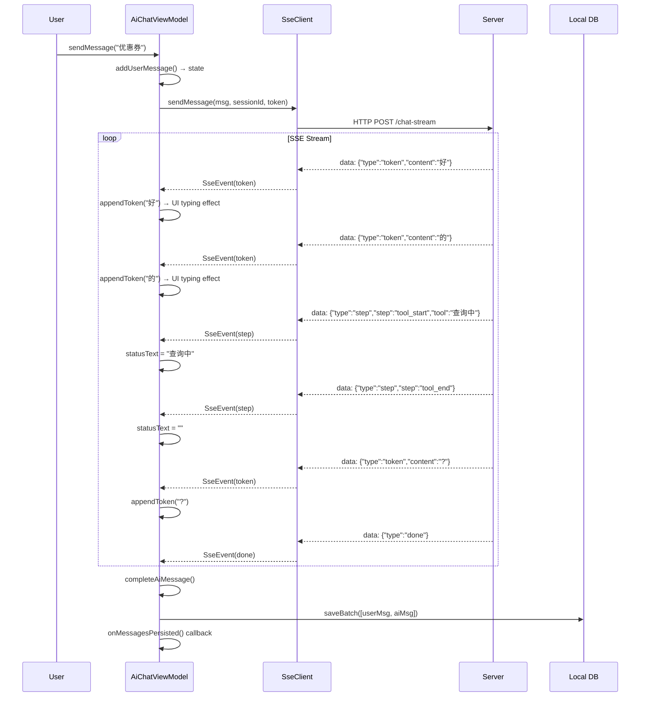

# AI SSE Streaming Architecture (Deprecated)

> **Status**: ✅ Deprecated — replaced by Socket `ai_token`/`ai_done` events  
> **Replacement**: [`ChatEventHandler._onAiEvent`](../../lib/ui/chat/handlers/chat_event_handler.dart:195) + [`LocalDatabaseService.saveAiMessage`](../../lib/ui/chat/services/database/local_database_service.dart:367)  
> **Reason for deprecation**: SSE requires HTTP connection per message; Socket reuses persistent connection, lower latency, no connection overhead.

---

## Overview

This document records the SSE (Server-Sent Events) streaming architecture that was used for AI customer service chat before migrating to Socket.IO-based streaming.

The core problem SSE solved: **Flutter's HTTP client (Dio) doesn't natively support streaming responses**. The browser's `EventSource` API works for Web, but on native platforms (iOS/Android/macOS), there's no built-in SSE client. This architecture provided a cross-platform SSE solution.

---

## File Map

```
lib/core/services/ai/
├── sse_client.dart          ← Barrel export (conditional)
├── sse_client_io.dart       ← Native: dart:io HttpClient
├── sse_client_dio.dart      ← Web: Dio + custom response streaming
├── sse_client_v2.dart       ← V2 protocol barrel (conditional)
├── sse_client_web.dart      ← Web: EventSource API
└── sse_types.dart           ← Shared types (SseEvent, SseEventType)

lib/core/store/ai_chat/
├── ai_chat_state.dart       ← State management (typing effect buffer)
└── ai_chat_view_model.dart  ← ViewModel (SSE lifecycle + DB persistence)
```

---

## Architecture

### Conditional Exports (Platform-Specific)

SSE clients use Dart's conditional exports to pick the right implementation per platform:

```dart
// sse_client.dart — V1 (POST + streaming response)
export 'sse_client_dio.dart' if (dart.library.io) 'sse_client_io.dart';

// sse_client_v2.dart — V2 (POST → GET streamId + streaming response)
export 'sse_client_web.dart' if (dart.library.io) 'sse_client_io.dart';
```

| Platform | V1 Client | V2 Client |
|----------|-----------|-----------|
| Web | `SseClient` (Dio) | `SseClientV2` (EventSource) |
| iOS/Android/macOS | `SseClient` (dart:io) | `SseClientV2` (dart:io) |

### Two Protocol Versions

#### V1 (Old Protocol) — `SseClient`

```
POST /api/v1/ai/customer/chat-stream
Authorization: Bearer <token>
Content-Type: application/json

{ "message": "...", "sessionId": "..." }

Response: text/event-stream (SSE)
```

- Single HTTP POST → streaming response
- JWT in Authorization header
- Used `dart:io` `HttpClient` (native) or `Dio` (Web)
- `SseClient` in [`sse_client_io.dart`](../../lib/core/services/ai/sse_client_io.dart:25)

#### V2 (New Protocol) — `SseClientV2`

```
Phase 1: POST /api/v1/ai/customer/chat
  { "message": "...", "sessionId": "..." }
  → Response: { "data": { "streamId": "..." } }

Phase 2: GET /api/v1/ai/customer/chat/stream/<streamId>?token=<jwt>
  → Response: text/event-stream (SSE)
```

- Two-phase: POST to register, GET to stream
- JWT in URL query param (GET has no body)
- Designed for better separation of message persistence and streaming
- Both phases in [`sse_client_io.dart`](../../lib/core/services/ai/sse_client_io.dart:243) (native) / [`sse_client_web.dart`](../../lib/core/services/ai/sse_client_web.dart) (Web)

### SSE Event Types

Defined in [`sse_types.dart`](../../lib/core/services/ai/sse_types.dart):

| Event | Direction | Description |
|-------|-----------|-------------|
| `token` | Server → Client | Single word/character of AI response (typing effect) |
| `step` | Server → Client | Processing step (thinking, tool_start, tool_end) |
| `done` | Server → Client | AI response complete |
| `error` | Server → Client | Error occurred |
| `transfer` | Server → Client | Transfer to human agent |

### State Management

[`AiChatState`](../../lib/core/store/ai_chat/ai_chat_state.dart) managed:

- **Typing effect buffer**: `currentStreamContent` — accumulated tokens
- **Message placeholder**: `currentAiMessageId` — ID of placeholder message created on first token
- **Session persistence**: `sessionId` — stored in SharedPreferences for LangGraph context continuity
- **Status text**: `statusText` — e.g., "Searching order..."

Key methods:
- `addUserMessage()` — creates user msg with `Uuid().v4()`
- `startAiMessage()` — creates placeholder AI msg with `Uuid().v4()`
- `appendToken()` — updates placeholder content (triggers UI rebuild for typing effect)
- `completeAiMessage()` — marks AI msg as success
- `setError()` — marks as failed or removes empty placeholder

### ViewModel Lifecycle

[`AiChatViewModel`](../../lib/core/store/ai_chat/ai_chat_view_model.dart:35) (`StateNotifier<AiChatState>`):

```
init()
  ├─ restore sessionId from SharedPreferences
  └─ load history from local DB

sendMessage(text)
  ├─ addUserMessage() → state
  ├─ create SSE client (V1 or V2)
  ├─ subscribe to event stream
  └─ send request

_onSseEvent(event)
  ├─ token  → appendToken() → state (typing effect)
  ├─ step   → _handleStepEvent() → status text
  ├─ done   → completeAiMessage() → _persistMessages() → DB
  ├─ error  → setError()
  └─ transfer → completeAiMessage() → _persistMessages() → onTransfer callback

cancelStream()
  └─ cancel SSE + reset state
```

### Data Flow



### Web-Specific: EventSource

On Web, [`sse_client_web.dart`](../../lib/core/services/ai/sse_client_web.dart) used the browser's native `EventSource` API for V2 protocol:

```dart
final eventSource = EventSource('$url?token=$token');
eventSource.onMessage.listen((event) {
    // Parse SSE event
});
eventSource.onError.listen((error) {
    // Handle connection error
});
```

### Web-Specific: Dio Streaming

On Web V1, [`sse_client_dio.dart`](../../lib/core/services/ai/sse_client_dio.dart) used Dio's response streaming:

```dart
final response = await Dio().post(
    url,
    data: {...},
    options: Options(
        responseType: ResponseType.stream,
    ),
);
// Stream response.data as bytes, decode lines
```

---

## Key Technical Decisions

### 1. Why not use Dio for native streaming?

Dio buffers responses on native platforms before delivering them to the app. For SSE, we needed real-time per-line delivery. `dart:io` `HttpClient` allows direct access to the response stream without buffering.

### 2. 30ms token delay

After each `token` event, a `Future.delayed(Duration(milliseconds: 30))` was added to give Flutter time to render intermediate frames. Without this, all tokens arrived in a single frame and the typing effect was lost.

### 3. First-token timeout (30s)

If the first `token` didn't arrive within 30 seconds, the connection was considered failed and the user saw "AI not responding, please retry".

### 4. Session continuity

`sessionId` was persisted to `SharedPreferences` so the AI (LangGraph) could maintain conversation context across app restarts.

---

## Migration to Socket.IO

The SSE architecture was replaced by Socket `ai_token`/`ai_done` events because:

| Aspect | SSE (Old) | Socket (New) |
|--------|----------|--------------|
| Connection | New HTTP per message | Persistent WebSocket |
| Latency | Connection overhead per request | No overhead |
| Platform support | Required per-platform implementation | Built into Socket.IO |
| Token delivery | SSE event stream | Socket `ai_token` events |
| Completion signal | SSE `done` event | Socket `ai_done` event |

New flow:

```
Socket ai_token (many) → _aiResponseBuffer accumulation
Socket ai_done → _saveAiMessage() → saveMessage to DB
→ DB stream triggers ChatViewModel UI update
```

### Files to delete when removing SSE

- `lib/core/services/ai/sse_client.dart`
- `lib/core/services/ai/sse_client_dio.dart`
- `lib/core/services/ai/sse_client_io.dart`
- `lib/core/services/ai/sse_client_v2.dart`
- `lib/core/services/ai/sse_client_web.dart`
- `lib/core/services/ai/sse_types.dart`
- `lib/core/store/ai_chat/ai_chat_state.dart`
- `lib/core/store/ai_chat/ai_chat_view_model.dart`
- `lib/core/store/ai_chat/` (entire directory)

And remove references in:
- `lib/core/store/ai_chat/ai_chat_view_model.dart:332` — `aiChatViewModelProvider`
- Any remaining `import` of `AiChatViewModel` or `SseClient`
